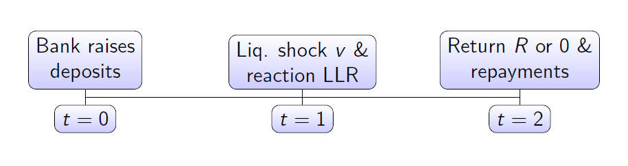
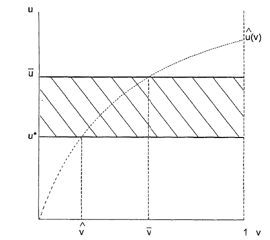

% The design of the LLR
% Koen Verbruggen
% Seminar Financial Economics, Tilburg University

Introduction
============

Overview
----------------
-  The Great Financial Crisis showed the weak points of the LLRs.
-  Who should be the LLR and bank supervisor?
-  Thornton (1802): The CB should be supervisor and LLR.
-  Bagehot (1873)
-  Only lend to solvent institutions
-  Lending at a penalty rate
-  Transparency about liquidity provision

But what about
------------------------
- Moral hazard
- Constructive ambiguity
- Information asymmetry
- Systemic risk & bailouts
- Deposit insurance
- Interbank market

Set-up of the model
================
Repullo(2000)
------------
- Focuses on the optimal allocation of LLR responsibilities between a
central bank and the DI.
- Three period model: t = 0 a bank raises an amount of deposits and
invest them in an illiquid asset that yields a return $\tilde{R}$ at t = 2. Assets
cannot be sold at t = 1, but possible to liquidate the bank with value
L
- At t = 1 a fraction of deposits,$v \in (0,1)$ is withdrawn. No possibility
to sell assets, therefore need to lend from LLR.

LLR Decision
---------
- Di or central bank has supervisory powers to gather information about assets of the bank.
- This leads to a signal:$u \in (0,1)$ at $t=1$
\begin{equation}\label{eq:repulloreturn}
  \widetilde{R}=\begin{cases}
    0, & \text{with probability 1-u}.\\
    R, & \text{with probability u}.
  \end{cases}
\end{equation} 
- Both agencies maximize their objective functions

Comparing three cases
=========================
Benchmark optimal policy
------------------------
- One step back, let $u$ be verifiable, so no agency needed to observe $u$.
- Compare (expected) returns for society:
\begin{equation}\label{eq:a}\tag{3.2}
uR-(1-u)c \geq L-c
\end{equation}
- If the left hand side is bigger, it is optimal for society to provide liquidity. That is, if:
\begin{equation}\label{optimalrepullo}\tag{3.3}
u\geq u^*= L/(R+c)
\end{equation}

Central Bank as LLR
------------------------
- Central bank cost function if it saves the bank, $\beta$: bankruptcy cost central bank 
\begin{equation}\tag{3.4}
(1-u)v+(1-u)\beta c
\end{equation}
- Cost of not providing liquidity: $\beta c$
- Central bank compares cost functions and provides liquidity if:
\begin{equation}\label{eq6}\tag{3.5}
u\geq \hat{u}(v)=\frac{v}{v+\beta c}
\end{equation}
- $\hat{u}(v)$ is minimum $u$ that has to be observed to make the central bank better off by saving the bank.

Deposit insurer as LLR
-------------------------
- Deposit insurer cost function if supporting the bank: $\gamma$ is bankruptcy costs for DI.
\begin{equation}\tag{3.6}
(1-u)(v+(1-v))+(1-u)\gamma c
\end{equation}
- Not providing liquidity:\begin{equation}\tag{3.7}
(1-L)+\gamma C
\end{equation}
- Again comparing both cases results in a minimum $u$:\begin{equation} \label{eq8}\tag{3.8}
u\geq \bar{u}= \frac{L}{1+\gamma c}
\end{equation}

Optimal allocation
--------------------------------
- $v$ is verifiable for society, possibility to calculate for each $v$ the allocation of the LLR to one of the two agencies that minimizes social cost.

Conclusions
=======================
Conclusions
----------------------
- Making some assumptions: More likely to have values of $u>u^*$ and small liquidity shocks happen more often.
- Give central bank supervisory powers and transfer to the deposit insurance corporation during the big liquidity shocks.

